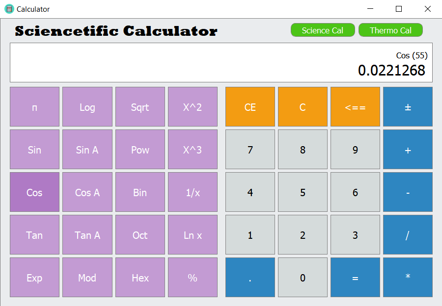
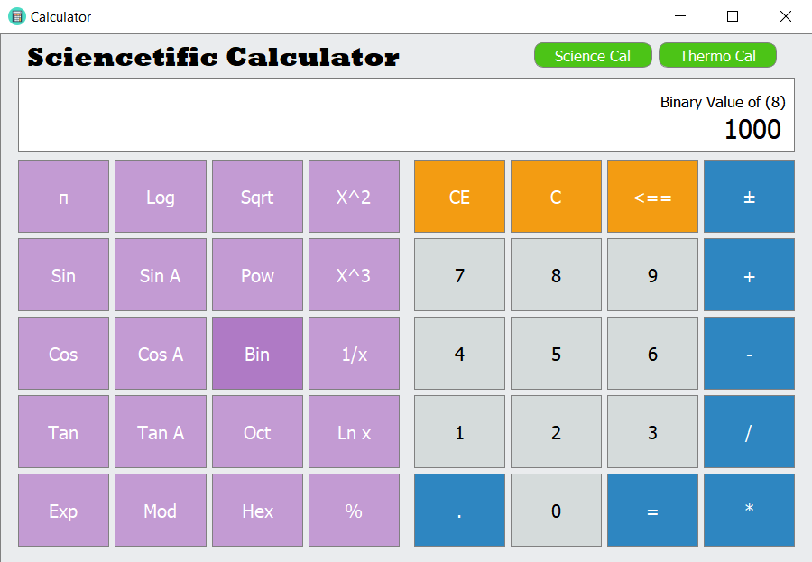
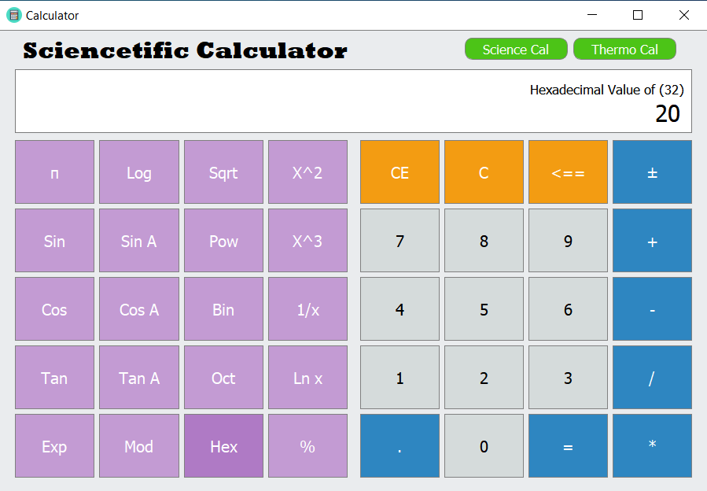
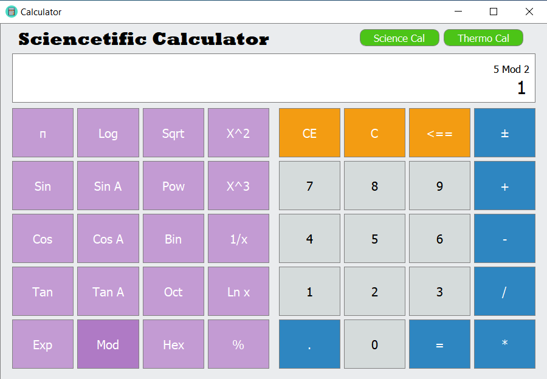
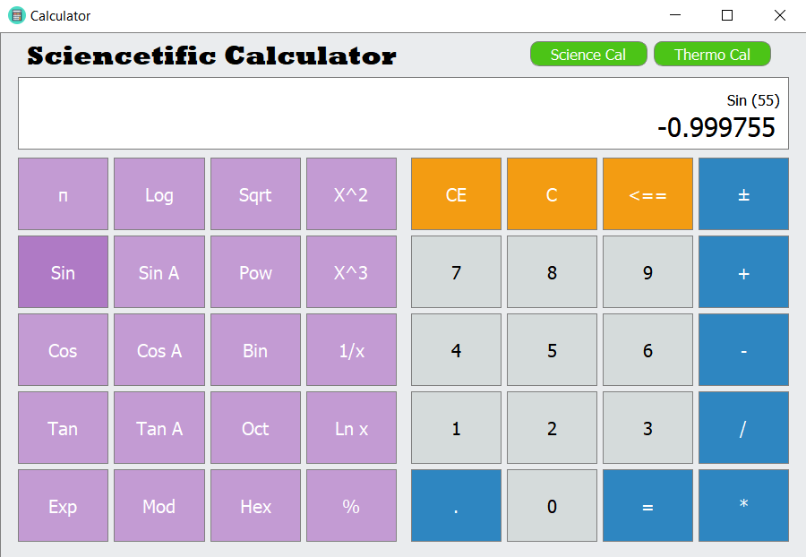
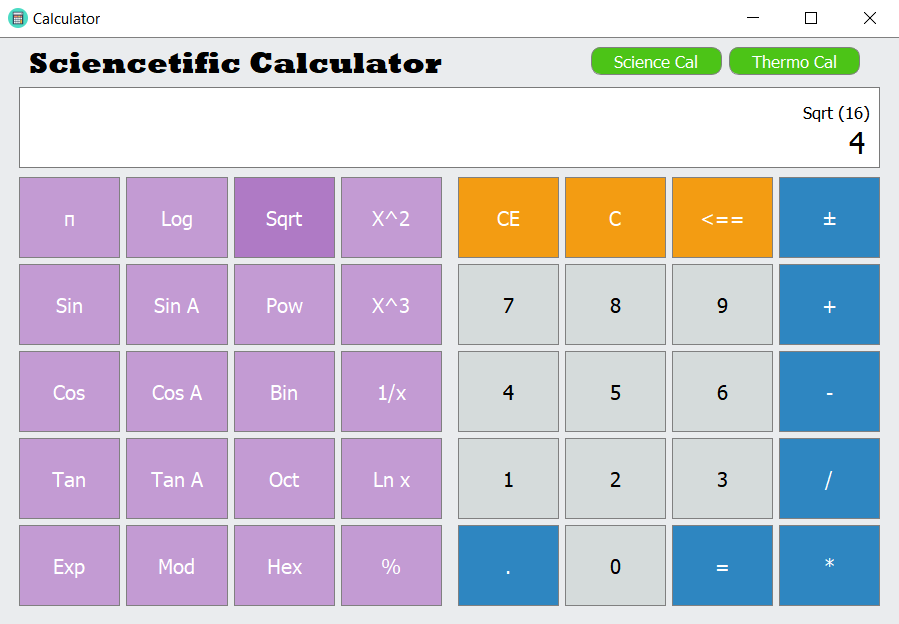
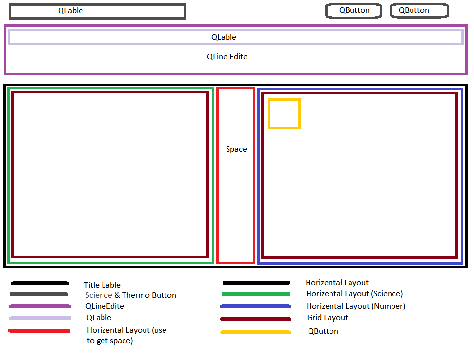

# Create Sciencetific_Calculator using C++
## About Calculator

    <body>
          This is a scientific calculator that can be used for solve complicated calculation.
          It has all the calculation of a typical scientific calculator, and can convert the temperature between Celsius, Fahrenheit and Kelvin. 
          It consists of 23 mathematical operations and includes 4 converting methods.  
The string, QtMath, QDebug, math.h and iostream functions are used. Horizontal layout and grid layout are used to create the UI. 
At the start, the QWidget containing the Temperature translation is hidden.
In some cases, unneeded sections have been hidden. It checks for data entry for all calculation functions. 
If no correct input has been made it will notify the user.  
    </body>

   <body> This calculator can handle this opperations. 
   

       <ul>
           <li>Basic Opperation</li>
           <li>Log and Anty Log</li>
           <li>Sin and Antysin value</li>
           <li>Cos and Antycos value</li>
           <li>Tan and Antytan value</li>
           <li>Decimal to Binnary</li>
           <li>Decimal to Octal</li>
           <li>Decimal to Hexa decimal</li>
           <li>Sqrt</li>
          <li>Sqrt</li>
          <li>Mod</li>
          <li>Power</li>
          <li>Exp</li>
          <li>% value</li>
          <li>Pi</li>
           
          <li>Celsius to Kelvin</li>
          <li>Kelvin to Celsius</li>
          <li>Fahrenheit to Celsius</li>
          <li>Celsius to Fahrenheit to </li>
       </ul>
 

 
Are you interst to develope....!! Please Do it....!!

   </body>

### Interface 01 Scientific Calculation UI
 

 
 ### Interface 02 Temperature Converter UI
 

 
 ### Interface 02 Using CSS
 

 

 
 ## Opperations / Methods
 #### Calculation
 

 

 
 

 

 
 

 

  

  
  #### Heat Calculation
 

 

 
 ## UI Architechture
 

 
 <h1 align="center">Thank You....!!</h1>
